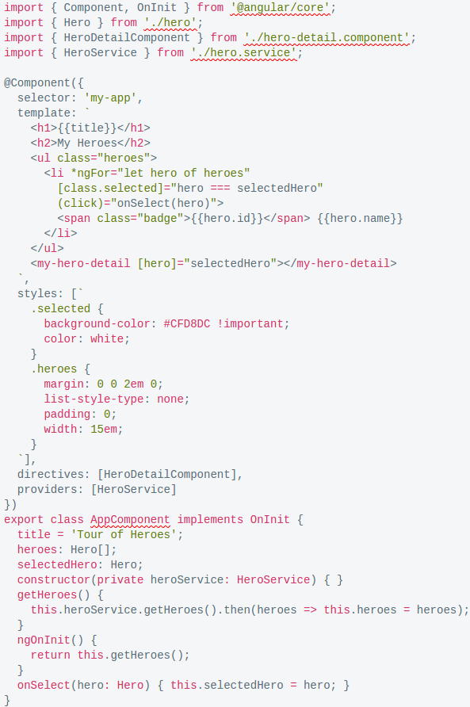

# Angular-io-Code

Main repository for Angular-io-Code Color Theme

# Purpose

The purpose of the organization Angular-io-Code is to provide color theme 100% alike to the one used in and from Angular.io for all major cross platform text editors.

# Credits

The original theme is the one stored in this repository.

It was made with (http://tmtheme-editor.herokuapp.com) and we appreciate the project TmTheme-Editor.

For more info visit (https://github.com/aziz/tmTheme-Editor).

We want to thank to (https://github.com/aziz/tmTheme-Editor), the creator of theme used at https://angular.io  and (https://angular.io) itself beacuse they are the reason for creation of RealGithub theme.

# Mismatch

If you find any mismatch from github's theme plase make a new Issue or new Pull Request to this repository not to any other repository part of our organization.

# Pull Request

- Edit (http://tmtheme-editor.herokuapp.com/#!/editor/theme/Angular-io-Code)

- Compare with (https://angular.io)

- Save localy

- Download

- Make a Pull Request

# Enjoy the coding experience!

# We hope we bring you the same coding experience as browsing at (https://angular.io)!

# We <3 Angular!

# Screenshot

